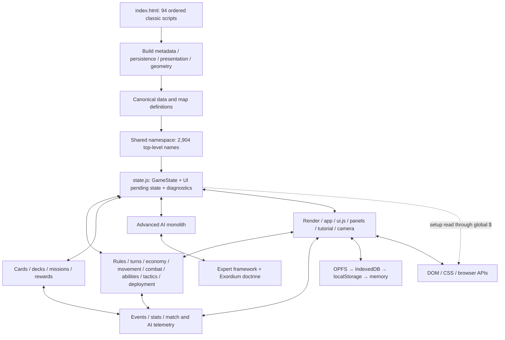

# AR-AC1 — Dependency Map

Baseline: `fef34ddf34fa20e111fbfe0d6721448b7e5bc6c5`  
Scope: all 94 classic scripts loaded by `index.html`; no runtime modification.

> Post-boundary note (2026-09-07): this document remains the historical 94-script entry inventory. The current runtime has 114 ordered scripts after the reviewed additions through `src/ai/move_execution.js` and `src/ai/combat_execution.js`. Setup, Match Data, map and bounded Rules flows use the previously documented explicit seams. Thirteen Advanced AI slices now use explicit late-bound query/effect ports through movement execution, post-move finalization, attack-only execution, stationary action and emergency action. Counts and the historical 67-file SCC below have not been silently recomputed.

## Executive finding

Arena Rubra is already split into many responsibility-named files, but those files do not form isolated modules. They share one classic-script namespace, one mutable `state` object, transient UI globals, browser APIs and pervasive `typeof ... === "function"` compatibility calls. Static cross-reference analysis finds a single strongly connected component containing 67 runtime/data files. This is the measurable form of the current coupling: file separation exists, dependency direction mostly does not.

The safe AC1 strategy is therefore not a directory rewrite or immediate mass ESM conversion. It is to establish one tested seam at a time, preserve legacy entrypoints as explicit bridges, and shrink the 67-file component incrementally.

## Measurement and limitations

`AR_AC1_GLOBALS_INVENTORY.json` is the deterministic per-script source. It records load order, responsibility, cross-script global reads, mutable writes, published names, browser APIs, DOM/state/storage/telemetry flags, profile and direct test references.

Static totals:

| Metric | Count | Interpretation |
| --- | ---: | --- |
| Runtime classic scripts | 94 | Sequential synchronous loader contract |
| Effective published top-level names | 2,904 | Functions/constants/variables visible to later classic scripts; not all are intentional public API |
| Mutable/global write labels | 124 | Includes 46 explicit `globalThis`/`window` overrides and summarized `state.*` writes |
| Direct or `$`-mediated DOM dependency | 38 files | UI/browser boundary is spread across runtime |
| Shared `state` dependency | 53 files | Authoritative data and UI/diagnostic state are not isolated |
| Storage dependency signal | 18 files | Persistence is not confined to a data layer |
| Telemetry/statistics dependency signal | 34 files | Diagnostics and rules/gameplay pathways overlap |
| DEV-capability files loaded in both profiles | 6 | Hiding is not load exclusion |
| Expert/experimental files loaded in both profiles | 8 | Distribution loads the experimental Expert stack |

Reads are lexical candidates after comments/string literals are removed; dynamically constructed names and some aliases need runtime tracing. `state.*` is intentionally summarized rather than claiming property-perfect write analysis. The map is an architectural inventory, not proof that every path executes.

The supplemental `ArenaRubra.zip` does not change this graph. Its `index.html` is byte-identical to the checkout and still loads the same 94 scripts. The ZIP-only `src/android_runtime_diagnostics.js` is ignored, orphaned and not referenced by the loader, so treating it as a runtime node would misrepresent the application.

## Current runtime topology



The arrows are bidirectional where callbacks, shared state mutation or render/controller calls close the loop. The intended future direction should instead be roughly `DOM → SetupAdapter/UI adapter → GameCore → new authoritative state → projections`, with persistence and telemetry observing explicit contracts.

## Loader layers and order-sensitive behavior

| Order | Layer | Files / role | Order-sensitive observations |
| --- | --- | --- | --- |
| 1–12 | legacy constants, build, storage, themes, asset services, enums, hex, geometry | Establishes early globals and browser services | Persistence and presentation are available before canonical game data |
| 13–20 | terrain/maps/runtime/events/board | Defines map catalog and foundational board/event helpers | Map runtime expects data globals and later consumers expect all functions to exist |
| 21 | Advanced AI | `src/ai.js` is loaded before factions and unit/card catalogs | Safe only because most references are inside functions called later; declaration-time evaluation would break |
| 22–31 | canonical data | factions, 115 units, tactics, missions, 50 decks, tutorials | Data is global and mutable by later normalization/patch code |
| 32–40 | state, missions, cards/deck and card presentation | Creates shared state and card/mission services | `state.js` publishes both match and UI globals; card renderer is mixed with DOM |
| 41–46 | calibration labs and editors | DEV tools and player card-pool/deck surfaces | All load in Distribution today despite later guards |
| 47–64 | lifecycle and gameplay domains, stats, telemetry | Rules and application functions mutate the shared object | No explicit dependency injection or authoritative action boundary |
| 65–72 | Expert AI stack | Common, four stubs, 263 KB Exordium, router/runtime | Entire experimental stack loads publicly; Exordium dominates implementation |
| 73–78 | rendering, feedback, SFX, overlay, tutorial | DOM projections and orchestration | Tutorial also owns persistence and dynamically injected styles |
| 79–90 | result/tutorial compatibility, game/turn/controller, diagnostics, UI shells | Lifecycle and interaction orchestration | Later files call and wrap earlier globals; `main.js` is not an application entrypoint in the conventional sense |
| 91 | `src/ui.js` | Boot, Match Data, profile, menu/theme, global overrides, Snow map | Monkey-patches storage/control-center/map functions and calls boot |
| 92–94 | splash, mobile, current camera interaction | Immediate initialization after `ui.js` | `bootArenaRubra()` has already been called; correctness relies on async timing and independent late initialization |

Specific load-order hazards:

- `src/ui.js` calls `arenaInstallOfficialSnowMapF9W2a1()` and then `bootArenaRubra()` at file end. `splash.js`, `mobile.js` and `camera_interaction.js` load afterward and initialize themselves independently.
- The Snow map is a large literal in `ui.js`. It patches `getBuiltinMapDefinitions` and `getMapDefinitionById`, so the canonical runtime map set depends on a UI file loaded at position 91.
- `ui.js` explicitly overrides 30 named globals in its own inventory entry, including storage/history, result recording, control-center providers and theme/profile APIs.
- `rules.js` declares `resolveEndOfRound`, `maybeAutoResign` and `checkVictory` twice. In classic script semantics the later declarations win; deleting the earlier “legacy” definitions without characterization would still be risky because source-based tests and historical assumptions may reference them.
- There is no `package.json`, lockfile, bundler manifest, module graph or declared test runner. `index.html` is the de facto linker.

Post-boundary status: the first two bullets above are historical. Snow BF now resides in the DOM-free `data/official_maps_f9w2a1.js` provider, which is loaded before and merged exactly once by `data/map_definitions.js`. `src/ui.js` no longer contains the Snow payload, installer or wrappers around `getBuiltinMapDefinitions` and `getMapDefinitionById`; `bootArenaRubra()` remains UI-owned. Classic-script order is still a contract, but its direction is now explicit: `official map provider -> map definitions -> map runtime -> UI`.

## Primary coupling regions

### Setup, state and game lifecycle

Current flow:

```text
DOM controls
  -> global $(id) in state.js
  -> readGameSetupFromDom()
  -> newGame()
  -> createInitialGameState(setup)
  -> shared global state
```

`state.js` owns `state`, selection/mode and eleven pending interaction variables. It also defines the global `$` helper and reads map, players, factions, commanders, deck selection, player mode, auto-resign, AI mode, pace and game scale directly from controls. `game.js` calls that reader even when overrides are passed, and `chooseFirstPlayer()` separately reads `$("initiativeMode")`.

`createInitialGameState(setup)` does not directly call `document`, but it is not a pure standalone factory: it reads global constants and map/hex/telemetry helpers. The low-risk first goal is therefore “DOM-free with explicit injected catalog helpers”, not falsely claiming it is already an isolated GameCore.

### Shared state ownership

| State class currently co-located | Created/owned by | Principal writers/readers | Risk |
| --- | --- | --- | --- |
| Authoritative match: map, cells, units, players, turn, ENE, pressure, effects, cards | `state.js`; replaced by `game.js` | almost every gameplay domain, AI, tutorial, controller | No central action/apply API; any writer can bypass invariants |
| UI interaction: selected unit, mode, pending ability/build/purchase/tactic/deployment/target/card | top-level `let` values in `state.js` | controller, render/game screen, missions, tactics, deployment | Not namespaced; lifecycle resets depend on coordinated globals |
| AI memory/diagnostics | branches in GameState | `ai.js`, Expert runtime/doctrine, turns/game | Disabling diagnostics is not demonstrably independent of behaviour |
| Mission telemetry | branch in GameState | missions, mission AI/rewards, telemetry/UI | Metrics and mission progression share object ownership |
| Match/F9/card diagnostics | branches in GameState | telemetry, stats, deck, UI, control center | Serialization authority and diagnostic projections are ambiguous |
| Persistent UI/data state | data store, storage facade, `ui.js`, tutorial, calibration labs | asynchronous and synchronous facades | Multiple compatibility paths and overrides complicate migration |

Before extraction, property-level writers should be runtime-traced or narrowed with characterization tests. A future split into GameState, AIState, MatchTelemetry, UIState and PersistenceState is directionally correct, but doing it in one patch would change too many serialization and compatibility assumptions.

### Gameplay domain knot

The core domains are physically separate but logically cyclic:

- movement queries board/map/state and triggers render, telemetry, tutorial and post-action checks;
- combat queries abilities/status/terrain and writes lifecycle, attribution, events, telemetry and UI feedback;
- rules invokes economy, pressure, lifecycle and result recording; turns calls rules and AI;
- tactics/abilities/deployment call deck/economy/controller/render paths and mutate pending UI globals;
- AI calls almost every validation/application function directly rather than submitting an explicit action contract.

This explains why future authoritative networking is currently expensive: there is no single `validate(action, state)` / `apply(action, state)` seam independent of DOM and callbacks.

### Persistence and Match Data

`src/data_store.js` provides the clearest existing boundary: OPFS first, then IndexedDB, localStorage and memory, plus legacy mirroring/migration. `src/storage.js` is a synchronous compatibility facade. However, `src/ui.js` contains Match Record schema/normalization, telemetry storage, migration, result recording, statistics projections and global overrides of storage/control-center APIs. `tutorial_runtime.js` and calibration/editor files also persist directly.

Post-boundary status: the schema/normalization, telemetry store, migration, result-recording and history export core described above now resides in `src/data/match_data.js` and is characterized as DOM-free. `src/ui.js` retains statistics/history/telemetry presentation and boot orchestration. Legacy global entrypoints, keys and schemas are intentionally preserved, so this closes ownership of the core but does not yet replace the compatibility facade or other direct persistence users.

Consequences:

- UI extraction cannot safely proceed without preserving legacy keys, envelopes and sync mirrors;
- Match Data core cannot be tested as a DOM-free service while defined in `ui.js`;
- profile visibility and storage capability are coupled in the same file that boots the application.

### AI asymmetry

| File | Size | Finding |
| --- | ---: | --- |
| `src/ai.js` | 298,374 bytes / 5,082 lines | One container for perception, scoring, purchasing, movement, attacks, tactics and five faction doctrines |
| `src/expert_ai/expert_exordium.js` | 263,187 bytes / 4,702 lines | Large faction-specific Expert doctrine with repeated historical declarations/overrides |
| `expert_common_strategy.js` | 10,945 bytes | Existing shared strategy seed |
| `expert_runtime.js` | 28,250 bytes | Existing runtime/fallback/telemetry boundary |
| Nexus/Liberti/Agathoi/Fabeot Expert files | 237–243 bytes each | `architecture_only` stubs; no Starter blocker |

Advanced is the sufficient official maximum for Starter. Expert must remain experimental; AC1 should not use consolidation as a reason to implement four doctrines.

### UI, CSS and ownership

| Surface | Size | Coupling evidence |
| --- | ---: | --- |
| `index.html` | 94,043 bytes / 1,709 lines | application markup, 404 IDs, 132 buttons and linker script list |
| `css/style.css` | 329,517 bytes / 10,625 lines | 97 media queries, 697 `!important` occurrences; historical override layers |
| `src/ui.js` | 195,164 bytes / 2,638 lines | boot, Match Data, profiles, themes, storage/global patches and Snow map |
| `src/render.js` | 116,252 bytes / 2,198 lines | board and multiple UI projections |

`ui.js` and `tutorial_runtime.js` inject additional `<style>` elements at runtime. Profile Distribution sets visibility/guards after load; it is not a separate loader. Theme code also wraps earlier global functions, so ownership is behavioural as well as CSS-based.

## Known cycle set

Building a file graph from each inventory entry’s cross-global reads and each name’s provider produces one 67-file strongly connected component. It spans data/cards/maps, state, all major gameplay domains, AI/Expert, events/telemetry, render/UI, storage and tutorial. The exact member list is reproducible from `AR_AC1_GLOBALS_INVENTORY.json`; representative closed loops are:

```text
state -> map_runtime -> shared state helpers -> state
game -> turns -> rules -> render/result recording -> ui -> game
controller -> movement/combat/tactics -> postActionChecks -> turns/rules -> render -> controller state
ai -> gameplay applicators -> telemetry/events -> Expert/AI callbacks -> ai
storage -> ui Match Data overrides -> control center -> storage
map_runtime -> UI Snow map monkey patch -> map selectors -> map_runtime
```

Because the graph is lexical and globals may be guarded, 67 is a conservative coupling indicator rather than a runtime-call-stack claim. It is still sufficient to reject mass extraction.

## External API boundaries

| Boundary | Current users | Required AC1 direction |
| --- | --- | --- |
| DOM / global `$` | state, game, render/UI, missions UI, editors, tutorial, camera | Restrict to adapters and projections |
| OPFS/IndexedDB/localStorage | data store, storage, UI Match Data, editors, tutorial, labs | One persistence API plus explicit migrations |
| Timers/animation frames | AI bot loop, rendering/motion, tutorial, camera, audio | Injectable scheduler/clock for deterministic tests where behaviour-sensitive |
| Random/time | match ID, initiative, seeded telemetry controller, AI | Seeded source must be passed into GameCore/action execution |
| File/Blob/Object URL/clipboard | exporters, editors, control center, assets | Keep at UI/IO boundary |
| Audio | audio manager, SFX, combat feedback | Presentation observer, never rule input |

## Profile loading map

Current `index.html` has one entrypoint. DEV and Distribution both load:

- Card Editor and Map Editor;
- renderer and menu calibration labs;
- control center and raw telemetry providers;
- all eight Expert files, including the 263 KB Exordium doctrine;
- development data-vault/persistence paths.

`arenaProductProfileApplyDomF9W2a()` hides, removes options or guards functions. This preserves player UX but does not satisfy the release requirement that excluded modules are absent from Distribution. Conditional loading must come only after GameCore/data contracts are stable; otherwise profile work will duplicate the global dependency problem.

## Risk-ranked boundaries

| Rank | Candidate boundary | Risk now | Reason |
| ---: | --- | --- | --- |
| 1 | SetupAdapter / setup DTO | low-to-medium | Small call surface, directly removes DOM from match construction path; chosen proposal |
| 2 | MatchRecord normalization + persistence service out of `ui.js` | medium | Clear data responsibility but migration and global override compatibility are sensitive |
| 3 | Pure hex/map validation package | medium | Much logic is already pure, but Snow map and custom-map persistence cross UI/data boundaries |
| 4 | Advanced AI perception/scoring/action slices | high beyond the extracted seams | Thirteen bounded slices are extracted through emergency combat action, while five deterministic 2P/3P/4P Golden Matches provide an integration gate; attack/ability scoring, purchase, tactic and turn orchestration still need local characterization |
| 5 | Shared Expert framework extraction from Exordium | high | Repeated declarations and lifecycle behaviour require stronger characterization |
| 6 | Authoritative action API across all core rules | very high | Desired end state, unsuitable as first patch |
| 7 | CSS/HTML decomposition or ESM loader conversion | very high as first move | Wide browser/profile/theme ownership and brittle source-string tests |

Only rank 1 is proposed in `AR_AC1_PROPOSED_FIRST_BOUNDARY.md`, and it remains blocked by the P0 FAIL result.

Post-boundary qualification: ranks 1 and 2 have been completed. Rank 3's principal map responsibilities now have canonical Snow data ownership, DOM/storage-free normalization, validation and pathfinding, DOM/state-free custom-map persistence behind explicit read/write ports, and DOM/storage/direct-state-global-free map/terrain/player queries behind injected providers. The 26 historical query globals remain as compatibility facades in `src/map_runtime.js`; low-level sanitizers and portable duplicate/import/export orchestration also remain there. After the Golden Match gate and focused 2P/3P/4P characterization, the bounded Pressure/round-limit and Victory/lifecycle orchestration slices of central rules were extracted behind explicit state/effect ports. Player cleanup internals remain in `src/player_lifecycle.js`; combat, movement, deployment, economy and the authoritative cross-domain action API remain unextracted. Rank 4 now has five bounded extractions. The three read-only AI Pressure-perception helpers reside behind a frozen service with explicit state/rule read ports, a 14-assertion pre/post oracle and a 26-assertion facade/loader/late-binding contract. F9T0 finalization memory resides in a stateful service with a 40-assertion pre/post oracle and 49-assertion boundary contract; memory storage, state reads and the two optional telemetry effects cross explicit ports. Nexus Network and Agathoi Green Line maturity reside in a frozen read-only service with a 26-assertion pre/post oracle and 25-assertion boundary contract; the legacy facades retain their default Pressure-profile argument. Garrison priority and plan construction reside in another frozen read-only service with a 30-assertion pre/post oracle and 35-assertion boundary contract; the returned `Set`, budget branches, critical-cell ordering and guard-target semantics are preserved. Deterministic Strategic Status composition resides in a fifth service with a 26-assertion pre/post oracle and 27-assertion boundary contract; its facade retains memory advancement, maturity queries and garrison-plan attachment in the characterized order. Scoring, action selection and faction doctrine remain in the monolith. Broad AI, central-rule, CSS and loader boundaries have not been authorized by these milestones. The final sentence above remains part of the historical proposal context, while current gate results are recorded in the individual boundary reports.

Subsequent rank-4 update: movement-context construction is the sixth bounded Advanced AI extraction. Its single-operation read-only service preserves faction-exclusive routing and computes every candidate feature once through explicit ports. Final faction scoring, tie-breaking, coordinate selection and action execution remain in `src/ai.js`.

Latest rank-4 update: deterministic score aggregation, exact tie-breaking and coordinate selection are the seventh bounded Advanced AI extraction. `src/ai/move_selection.js` preserves the emergency and C2E3 weights, optional Expert fallback, candidate order, coordinate identity and even the historical first-`NaN` lock. Faction-specific base scoring and movement execution remain in `src/ai.js`.

Latest rank-4 scoring update: the five faction-specific movement branches are the eighth bounded Advanced AI extraction. `src/ai/faction_move_scoring.js` preserves a 20-scenario score-and-call corpus behind 18 explicit read ports. Movement execution remains the adjacent stateful boundary in `src/ai.js`.

Latest rank-4 stateful update: `src/ai/move_execution.js` contains the ninth and tenth bounded Advanced AI extractions. The movement operation sequences Advanced-mode history and the authoritative movement port; the separately characterized post-move finalizer preserves War Push mutation, stationary/attack delegation, independent capability checks and error ordering behind seven explicit ports. Broader attacks, abilities, purchases, tactics and turn orchestration remain in `src/ai.js`.

Latest rank-4 combat update: `src/ai/combat_execution.js` contains the eleventh through thirteenth bounded Advanced AI extractions. Attack-only, stationary-action and emergency-action sequencing retain their historical progress guards, score ordering, continuation-marker mutations, vehicle ability windows and `+12` emergency priority through explicit ports. Authoritative attack/ability/movement rules remain outside the service and unchanged.

## AC1 measurement recommendations

For each approved patch, record:

1. files entering/leaving the 67-file strongly connected component;
2. number of implicit global reads replaced by explicit parameters/imports;
3. number of mutable global writers removed or routed through a named API;
4. targeted characterization and behaviour tests added before extraction;
5. baseline-visible functional outputs compared, including stable state fields and seeded results;
6. browser DEV and Distribution module-load evidence;
7. storage/schema compatibility evidence where applicable.

LOC and file count should remain secondary. A patch is useful only when it reduces implicit dependencies or writer ambiguity without changing the frozen game.
